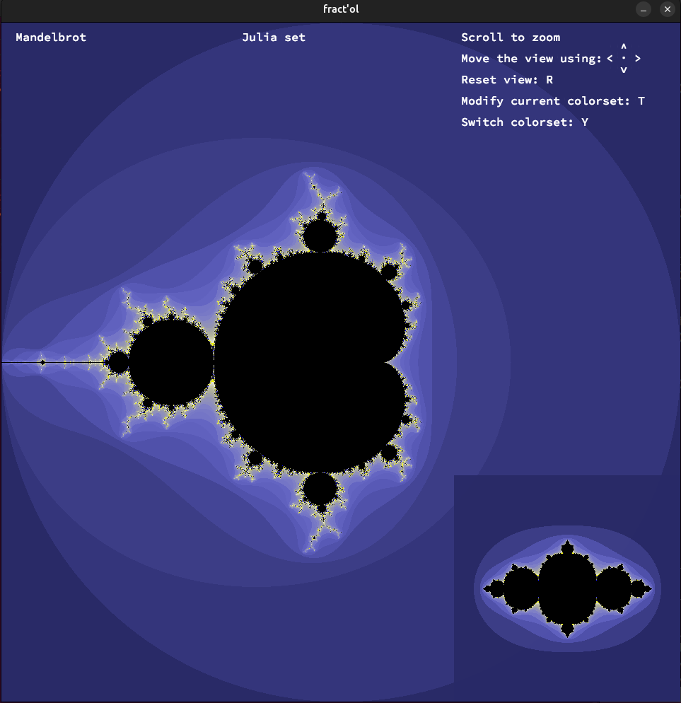

# 🌀 Fractal Visualizer

**Fract-ol** is a fractal visualizer written in C using [MLX42](https://github.com/codam-coding-college/MLX42), a simple cross-platform graphics library running on GLFW and OpenGL.

## ✨ Features

- Interactive rendering of:
  - Mandelbrot set
  - Julia set
  - Burning Ship fractal
- Real-time mouse interaction
- Smooth zooming and panning
- Dynamic color shifting

## 📸 Preview



## ⚙️ Requirements

- macOS or Linux
- Dependencies:
  - `cmake`
  - `glfw`
  - `OpenGL`

## 🧰 Installation

Clone the repo and build:

```bash
git clone https://github.com/usvapel/fract-ol.git
cd fract-ol
make
