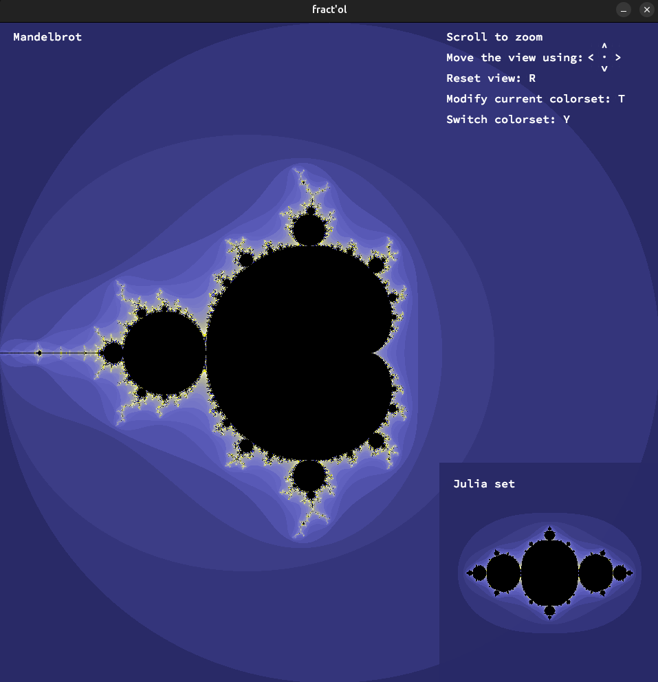
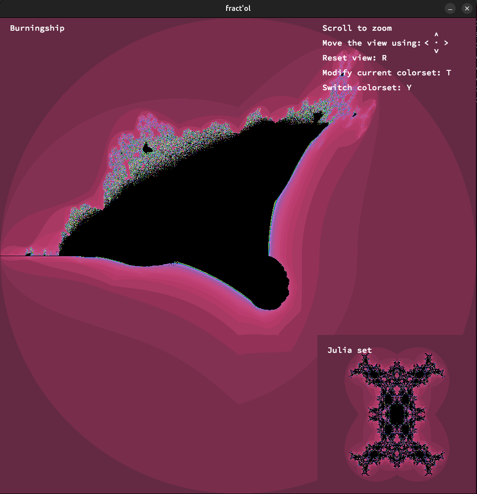
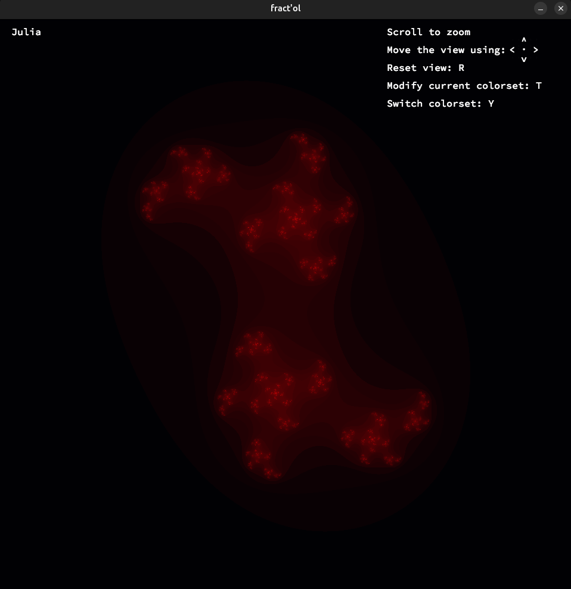

<p align="center">
  
  
</p>

# 🌀 Fractal Visualizer

**Fract-ol** is a fractal visualizer, written in C using [MLX42](https://github.com/codam-coding-college/MLX42), a simple cross-platform graphics library running on GLFW and OpenGL.  
The project is a part of 42 school curriculum

## ✨ Features

- This application supports real-time rendering and interaction with a selection of well-known fractals:
  - Mandelbrot set
  - Julia set
  - Burning Ship fractal
- Additional interactive capabilities include:
  - Real-time mouse interaction
  - Smooth zooming and panning
  - Dynamic color shifting

## 📸 Preview

<div style="display: flex; gap: 10px; align-items: center;">
  
  
  
</div>

<div style="
  background-color: #f6f8fa;
  padding: 20px 24px;
  border-left: 6px solid #00599C;
  font-family: 'Segoe UI', 'Roboto', 'Helvetica Neue', sans-serif;
  font-size: 16px;
  color: #1a1a1a;
  line-height: 1.6;
  margin-top: 12px;
  box-shadow: 0 2px 4px rgba(0, 0, 0, 0.05);
">
  <strong><em>Iteration Formula</em></strong><br>
</div>

The core of each fractal lies in an iterative function applied to each pixel mapped to the complex plane. For the Mandelbrot set, the formula is:


For the Burning Ship fractal, a slight modification is made: the real and imaginary components of the complex number are converted to their absolute values before squaring at each iteration, resulting in its characteristic shape.

## ⚙️ Requirements

- macOS or Linux
- Dependencies:
  - `cmake`
  - `glfw`
  - `OpenGL`

## 🧰 Installation

Clone the repo and build:

```bash
git clone https://github.com/usvapel/fract-ol.git
cd fract-ol
make
